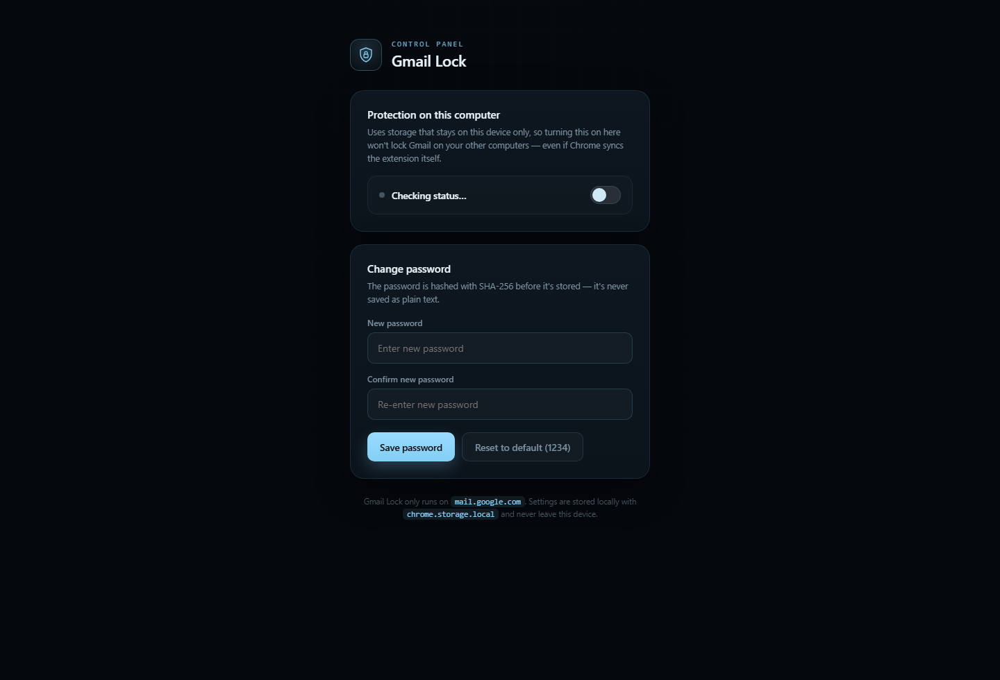

the moment the tab is closed — so refreshing Gmail does **not** ask for the
# Gmail Lock

A Chrome extension (Manifest V3) that locks Gmail with a password.

## Screenshot



## What it does

- Works only on `https://mail.google.com/*`
- Shows a full-screen lock until the correct password is entered
- Unlocks once per tab (refresh does not ask again)
- Stores settings locally on this computer only (`chrome.storage.local`)

## Default password

- Default password: `1234`
- You can change it from the extension settings
- You can reset it from the settings button: `Reset to default (1234)`

## Install (load unpacked)

1. Unzip the project.
2. Open `chrome://extensions`.
3. Enable Developer mode.
4. Click Load unpacked and select the `gmail-lock` folder.
5. Open extension settings and turn protection on.

## Quick update with CLI

```powershell
git add .
git commit -m "update"
git push
```
